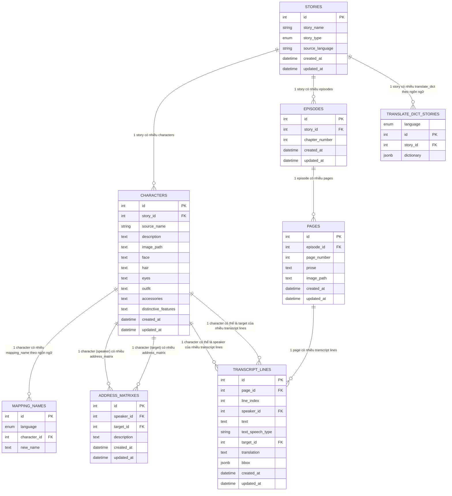

## Database schema (PostgreSQL)

```mermaid
erDiagram
    STORIES {
        int id PK
        string story_name
        enum story_type
        string source_language
        datetime created_at
        datetime updated_at
    }

    MAPPING_NAMES {
        int id PK
        enum language
        int character_id FK
        text new_name 
    }

    TRANSLATE_DICT_STORIES{
        enum language
        int id PK
        int story_id FK
        jsonb dictionary 
    }

    CHARACTERS {
        int id PK
        int story_id FK
        string source_name
        text description
        text image_path
        text face
        text hair
        text eyes
        text outfit
        text accessories
        text distinctive_features
        datetime created_at
        datetime updated_at
    }

    ADDRESS_MATRIXES {
        int id PK
        int speaker_id FK
        int target_id FK
        text description
        datetime created_at
        datetime updated_at
    }

    EPISODES {
        int id PK
        int story_id FK
        int chapter_number
        datetime created_at
        datetime updated_at
    }

    PAGES {
        int id PK
        int episode_id FK
        int page_number
        text prose
        text image_path
        datetime created_at
        datetime updated_at
    }

    TRANSCRIPT_LINES {
        int id PK
        int page_id FK
        int line_index
        int speaker_id FK
        text text
        string text_speech_type
        int target_id FK
        text translation
        jsonb bbox
        datetime created_at
        datetime updated_at
    }

    STORIES ||--o{ CHARACTERS : "1 story có nhiều characters"
    STORIES ||--o{ EPISODES : "1 story có nhiều episodes"
    STORIES ||--o{ TRANSLATE_DICT_STORIES : "1 story có nhiều translate_dict theo ngôn ngữ"
    EPISODES ||--o{ PAGES : "1 episode có nhiều pages"
    PAGES ||--o{ TRANSCRIPT_LINES : "1 page có nhiều transcript lines"
    CHARACTERS ||--o{ MAPPING_NAMES : "1 character có nhiều mapping_name theo ngôn ngữ"
    CHARACTERS ||--o{ ADDRESS_MATRIXES : "1 character (speaker) có nhiều address_matrix"
    CHARACTERS ||--o{ ADDRESS_MATRIXES : "1 character (target) có nhiều address_matrix"
    CHARACTERS ||--o{ TRANSCRIPT_LINES : "1 character có thể là speaker của nhiều transcript lines"
    CHARACTERS ||--o{ TRANSCRIPT_LINES : "1 character có thể là target của nhiều transcript lines"

```

